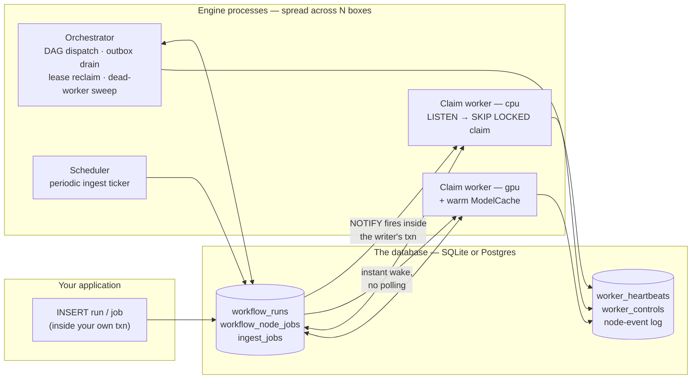
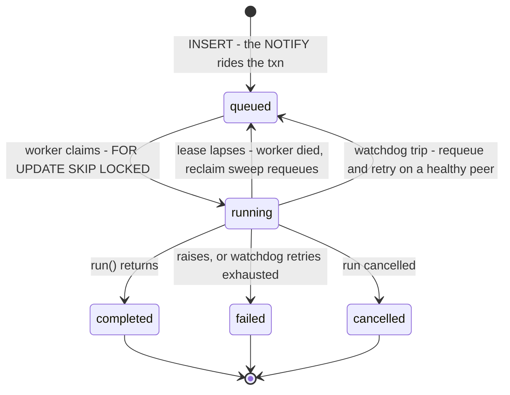
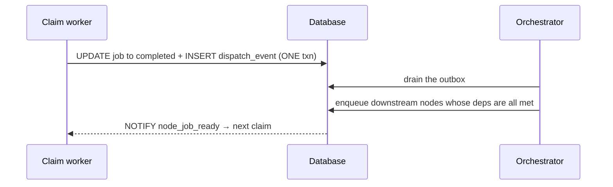

<div align="center">

# 🦜 broker_parrot

_Python package: **`queue_workflows`** (import name unchanged) · built on Postgres (or SQLite)._

### Turn the machines you already own into one self-healing job fleet.

> A workflow engine that uses your database as the queue and message bus — dispatching DAG and periodic jobs across worker processes, keeping GPU models warm, and recovering from crashes on its own.

Orchestrate work across a handful of heterogeneous CPU/GPU boxes with nothing but a database you already run. No Celery, no Redis to babysit, no cluster scheduler. Insert a row and the work is enqueued; a dead worker's lease lapses and its job re-runs somewhere healthy.

[](LICENSE)
[](#installation)
[](#installation)
[](#installation)

</div>

**queue_workflows** is a small, self-hosted workflow engine where **the database _is_ the message bus**. Inserting a row enqueues work; a trigger fires `LISTEN/NOTIFY` inside the writer's own transaction, so there's never a "queued but never woken" gap. Workers claim jobs with `SELECT … FOR UPDATE SKIP LOCKED`, renew a lease while they run, and a dead or wedged worker's job is automatically re-queued onto a healthy peer. It runs DAG node-jobs and periodic background jobs across boxes you already own, lets you flip any machine's worker **ON/OFF** on demand, and keeps a GPU model resident across same-model jobs.

As of **v1.0.0 the default backend is SQLite** — a daemon-less local file, zero server to stand up — so you can `import`, `configure()`, and run with nothing else installed. Point it at **Postgres** for a real fleet with one line.

> **There's no bundled dashboard — the engine emits what a dashboard needs.** Live per-host CPU/GPU/RAM over `pg_notify('hw_metrics', …)`, `worker_heartbeats`, the `node_queue.*_snapshot()` read models, and the `worker_controls` ON/OFF toggles are all there. Bring your own front-end — it's a great task to hand a coding agent. A newer **broker web service + operator panel** ([`docs/broker.md`](docs/broker.md), [screenshot](#-one-broker-for-many-projects)) also ships as a pure-stdlib, server-rendered option.

---

## Table of Contents

- [Why broker_parrot?](#-why-broker_parrot)
- [How it compares (vs. Triton Inference Server)](#-how-it-compares-vs-triton-inference-server)
- [Highlights](#-highlights)
- [Installation](#installation)
- [Core concepts](#-core-concepts)
- [Architecture at a glance](#-architecture-at-a-glance)
- [Example implementation](#-example-implementation)
- [Turning workers on/off](#️-turning-workers-onoff--the-operator-control-plane)
- [Host-defined queues + ingest jobs](#️-host-defined-queues--parametrised-ingest-jobs)
- [One broker for many projects](#-one-broker-for-many-projects)
- [Pluggable storage backends](#️-pluggable-storage-backends)
- [GPU models & LLM backends](#-gpu-models--llm-backends)
- [Migrations](#️-migrations)
- [Tests](#-tests)
- [Documentation](#-documentation)
- [Background](#-background)
- [License](#️-license)

---

## ✨ Why broker_parrot?

The pitch in one line: **the database you already run is the most durable thing you own — so let it _be_ the queue.** No second broker to operate, no scheduler cluster. You `INSERT` a row inside your own transaction and the work is enqueued; a crashed worker's lease lapses and the row is re-queued. Purpose-built for a **small, self-hosted, heterogeneous CPU/GPU fleet you already own** — not a 1,000-node cloud.

**Reach for it when** you have a handful of self-hosted boxes, want GPU-aware scheduling (warm models, per-box ON/OFF) and crash-safe recovery, and would rather not stand up a broker or a workflow platform just to move jobs between machines.

**Look elsewhere when** you need a hosted UI, multi-region durability, or versioned-workflow replay at large scale — that's a different class of tool.

---

## 🆚 How it compares (vs. Triton Inference Server)

People often ask how this relates to [NVIDIA Triton Inference Server](https://docs.nvidia.com/deeplearning/triton-inference-server/user-guide/docs/index.html). **They solve different problems and compose rather than compete.** Triton is a *model server* — it loads models into one process and answers inference requests synchronously, optimized for raw throughput. queue_workflows is a *durable job orchestrator* — it routes async work across a fleet of boxes with crash recovery, using the database as the bus. Triton makes one model fast on one node; queue_workflows reliably moves a unit of work to whichever node holds the right warm model and survives failure. You can even run **Triton (or vLLM/ollama) _as a node body inside_ a queue_workflows job** — the engine schedules and recovers the work, Triton serves the tensors.

| Dimension | **queue_workflows** | **Triton Inference Server** |
|---|---|---|
| **Category** | Durable async workflow / job-queue engine | Real-time model inference server |
| **Core interaction** | `INSERT` a row → job runs later, durably | HTTP/gRPC request → synchronous response |
| **Latency profile** | Async, seconds–hours; survives restarts | Sub-second request/response |
| **Unit of work** | Arbitrary node body / ingest task (`run(...)`); a model call is just one kind | A model inference (tensors in → tensors out) |
| **Multi-step / pipelines** | First-class **DAG** dispatch with a durable outbox, deps, skip-if, fan-out | Model **ensembles** + Business Logic Scripting |
| **Throughput tricks** | None by design — concurrency-1 per worker by contract | **Dynamic batching**, concurrent model execution |
| **Model lifecycle** | Warm `ModelCache`, idle-unload, **warm-model affinity routing** across the fleet | Model repository: load/unload, versioning |
| **Framework backends** | Host-agnostic — you bring `run(...)`; no framework coupling | TensorRT, PyTorch, ONNX, OpenVINO, vLLM, Python |
| **Fleet & scheduling** | DB `FOR UPDATE SKIP LOCKED` claim + `LISTEN/NOTIFY`, lease + reclaim across N boxes | Per-node server; scaling delegated to **Kubernetes** |
| **Crash recovery** | Lease lapse → re-queue onto a healthy peer; wall-clock / stall / GPU-health watchdogs re-queue-and-retry | K8s restarts the pod; no built-in job re-queue |
| **Operator control** | Per-`(host, queue)` **ON/OFF** control plane (hard-stop frees VRAM) | No fleet ON/OFF; managed by K8s |
| **State & durability** | Everything in the DB — jobs, leases, append-only event log, heartbeats | Stateless server; metrics only |
| **Background / periodic work** | First-class **ingest jobs** + scheduler ticker | Out of scope — request-driven only |
| **Dependencies** | Just a **database** (SQLite default, or Postgres via psycopg 3; optional redis/mongo) | NVIDIA runtime / CUDA; typically GPU + K8s for scale |

**Where they overlap:** both keep models warm and care about GPU efficiency. **Where they don't:** Triton has no durable queue, no DAG, no cross-host crash-recovery, no operator ON/OFF, and no periodic work; queue_workflows has no dynamic batching, no native framework backends, and isn't a low-latency request server. Use Triton to make an inference *fast*; use queue_workflows to make the *work* reliable across the fleet.

---

## 🌟 Highlights

- 🔒 **Exactly-once claims** — `SELECT … FOR UPDATE SKIP LOCKED` over a database queue, woken instantly by `LISTEN node_job_ready` so workers never poll-spin or double-run a job.
- ❤️‍🩹 **Self-healing leases** — a live worker renews its lease as it runs; a crashed or wedged worker's lease lapses and the orchestrator re-queues the row onto a healthy peer.
- 🔗 **DAG dispatch with a durable outbox** — a node's terminal status and its dispatch event are written in one transaction, then drained to fan out the next ready nodes — no lost edges, no double fan-out.
- 🔥 **GPU warm-model cache** — keeps a single model resident across consecutive same-model jobs and only drops/reloads on a real swap, so the expensive load happens once.
- ⚡ **"Run next" priority flag** — flag a queued node so the next worker asking for its queue claims it first — jump an urgent job to the head with one call.
- 🟢 **Operator ON/OFF control** — hard-stop or park any `(host, queue)` worker on demand; a hard stop requeues the in-flight job to a free peer and frees its RAM/VRAM, with no restart.
- 📊 **Per-host telemetry** — live CPU/GPU/RAM and capacity stream over `pg_notify('hw_metrics', …)` plus `worker_heartbeats`, ready to drive a dashboard.
- ⏰ **DB-native scheduler** — a built-in ticker enqueues recurring background jobs at scheduled minutes (with optional hour windows) — no cron, no external beat process.
- 🗄️ **Pluggable store** — SQLite (default), Postgres, Redis, or MongoDB, behind one durable-queue contract.

---

## Installation

Requires **Python 3.10+**. As of **v1.0.0 the default backend is SQLite** — a daemon-less local file, zero server to run — so the only hard runtime dependency is `psycopg` (used by the SQLite *and* Postgres paths). For a Postgres deployment (**14+**), opt in with `configure(db_backend="pg")` or `export QUEUE_WORKFLOWS_DB_BACKEND=pg`.

Not on PyPI yet — install straight from GitHub:

```bash
pip install "queue_workflows @ git+https://github.com/robertziel/broker_parrot"
```

Optional extras:

```bash
# hw_metrics CPU/RAM probe (GPU probe shells out, no extra dep)
pip install "queue_workflows[metrics] @ git+https://github.com/robertziel/broker_parrot"

# alternative storage backends
pip install "queue_workflows[redis]   @ git+https://github.com/robertziel/broker_parrot"
pip install "queue_workflows[mongodb] @ git+https://github.com/robertziel/broker_parrot"   # needs a replica set
```

---

## 🧩 Core concepts

Three ideas carry the whole design. The full treatment is in [`docs/architecture.md`](docs/architecture.md).

**The database is the bus.** `INSERT`ing a row *is* enqueuing the work. A trigger fires `pg_notify('node_job_ready', …)` **inside the writer's transaction**, so a listening worker wakes the instant the row is visible — no separate publish step, no lost-wakeup window.

**Three process roles, one database.** All three run as ordinary processes against the same DB:

- **Orchestrator** — the only process that bootstraps migrations. It runs the DAG dispatch loop, drains the dispatch-event outbox, sweeps for lapsed leases and dead workers, and resumes parked input nodes. No node bodies run here.
- **Claim worker** — **one process is one worker, concurrency-1 by contract.** It `LISTEN`s, greedily drains its queue on each wake, renews its lease while a job runs, and writes the terminal status + outbox event in one transaction. `cpu`/`gpu` draw DAG node-jobs; ingest-family queues draw standalone ingest jobs.
- **Scheduler** — a DB-native ticker that sleeps to the next scheduled minute and enqueues periodic `ingest_jobs` rows.

**Leases make it self-healing.** A live worker renews `lease_expires_at` (~every 10 s), so lease length is independent of job duration. A dead or wedged worker stops renewing; its lease lapses; the orchestrator's reclaim sweep flips the row back to `queued` (re-firing the NOTIFY). Layered on top are wall-clock, no-progress, and GPU-health watchdogs — each re-queues-and-retries rather than failing — plus an out-of-process dead-worker detector for hardware hangs. See [`docs/watchdogs.md`](docs/watchdogs.md).

---

## 🏗 Architecture at a glance

**The system.** Your app inserts rows inside its own transactions; the trigger's `NOTIFY` wakes workers the instant the row commits. Three kinds of engine processes — orchestrator, claim workers, scheduler — coordinate through nothing but the database:



**A job's life.** Every transition is a guarded `UPDATE`; crash recovery is just a lapsed lease:



**The durable outbox.** A worker never calls the dispatcher — it writes the terminal status *and* a dispatch event in one transaction, and the orchestrator fans out from there. Fan-out is retryable and survives any crash between the two steps:



The full treatment — including the watchdog stack and the host-agnostic hook seam — is in [`docs/architecture.md`](docs/architecture.md) and [`docs/watchdogs.md`](docs/watchdogs.md).

---

## 🛠 Example implementation

Here's the whole thing end-to-end: a trivial node, a pipeline that references it, a workflow that runs that pipeline, the host wiring, and a worker that executes it. Nothing here is pseudo-code — every call is part of the public API.

### 1. Define a node — one `run()` function

A node is a module exposing a single `run(...)`. The engine introspects the signature and **auto-wires well-known kwargs** by name — `out` (the run's output dir), `status_callback`, `cancel_event`, `inputs`, `model_handle` — so you only declare the ones you use. Return a JSON-able dict; its keys become the node's `context_delta` for downstream `$from` refs.

```python
# myapp/nodes/greet.py
from pathlib import Path
from typing import Any


def run(out: Path, name: str = "world", status_callback: Any = None) -> dict:
    """Trivial CPU node: write a file, return a tiny summary."""
    if status_callback:
        status_callback(0.5, "greeting")

    out.mkdir(parents=True, exist_ok=True)
    (out / "hello.txt").write_text(f"hello, {name}!\n")

    return {"primary_file": f"{out.name}/hello.txt", "greeted": name}
```

No base class, no decorator, no registration call — discovery is by dotted module name (configured below).

### 2. Reference it from a pipeline + workflow

Two small JSON files. The **pipeline schema owns the DAG** (`nodes` with `id` / `node` / `depends_on` / `gpu` / `inputs` / `outputs`); the **workflow** strings one or more pipeline steps together and maps run-level context into them.

<details>
<summary><code>myapp/pipelines/greet.schema.json</code> — the DAG (one node, CPU)</summary>

```json
{
  "name": "greet",
  "display_name": "greet · hello world",
  "requires_gpu": false,
  "inputs": {
    "type": "object",
    "properties": {
      "name": { "type": "string", "default": "world", "maxLength": 64 }
    }
  },
  "outputs": {
    "primary_file": { "type": "file", "mime": "text/plain" },
    "summary_keys": ["greeted"]
  },
  "nodes": [
    {
      "id": "greet",
      "node": "greet",
      "depends_on": [],
      "inputs":  [{ "name": "name", "from": "pipeline.name" }],
      "outputs": [{ "name": "hello.txt", "kind": "text" }],
      "gpu": false
    }
  ]
}
```

`"node": "greet"` resolves to the `myapp.nodes.greet` module via the `node_module_package` prefix set in step 3. `"gpu": false` routes the node-job to the `cpu` queue (set `true` for `gpu`).

</details>

<details>
<summary><code>myapp/definitions/greet.json</code> — the workflow (one pipeline step)</summary>

```json
{
  "name": "greet",
  "display_name": "greet — hello world",
  "mode": "node",
  "steps": [
    {
      "id": "greet",
      "kind": "pipeline",
      "pipeline": "greet",
      "inputs": { "name": { "$from": "parcel.label" } }
    }
  ]
}
```

The `$from` ref pulls `name` out of the run's `context` at execute time — late resolution: workers re-resolve refs when they pick up the job, not when it's enqueued.

</details>

### 3. Wire the host (`configure` + seams) and bootstrap

One startup module does the wiring. `configure()` only mutates the keys you pass; `db.bootstrap()` applies the engine's migration chain idempotently. The full hook reference is [`docs/configuration.md`](docs/configuration.md).

```python
# myapp/engine.py
import json
from pathlib import Path

import queue_workflows
from queue_workflows import db

DEFS = Path(__file__).parent / "definitions"
PIPES = Path(__file__).parent / "pipelines"


def _load_workflow(name: str) -> dict:
    return json.loads((DEFS / f"{name}.json").read_text())


def _pipeline_schema(name: str) -> dict:
    return json.loads((PIPES / f"{name}.schema.json").read_text())


def init() -> None:
    # 1. configure the engine (every key is optional)
    queue_workflows.configure(
        db_backend="pg",                    # v1.0.0: default is now "sqlite" — opt in for Postgres
        db_url_env="MYAPP_DB_URL",          # env var holding the DSN
        node_module_package="myapp.nodes",  # "greet" -> myapp.nodes.greet
        container_prefix="myapp-",          # cgroup attribution for hw_metrics
    )

    # 2. tell the dispatcher where the DAG definitions live
    queue_workflows.set_workflow_provider(_load_workflow, _pipeline_schema)

    # 3. apply the engine's migration chain (idempotent)
    db.bootstrap()
```

> 💡 The DSN lives in the `MYAPP_DB_URL` **environment variable**, not in code — `configure(db_url_env=...)` only names the variable to read. Keep secrets in your secrets store.

### 4. Launch the processes (console scripts)

Independent processes run against the one database. You run a **claim worker per queue per host**; the **orchestrator** drives DAG fan-out + lease reclaim; the **scheduler** fires periodic ingest jobs (skip it if you have none). Each process calls `myapp.engine.init()` at startup, then hands off. See [`docs/deployment.md`](docs/deployment.md).

```bash
queue-orchestrator                 # DAG dispatch loop + dead-worker lease reclaim (bootstraps migrations)
queue-claim-worker --queue cpu     # claims & runs cpu node-jobs (our greet node)
queue-claim-worker --queue gpu     # add one per GPU host for gpu-routed nodes
queue-scheduler                    # optional — only if you registered ingest tasks
```

Or call the entry points directly from your own bootstrap:

```python
from myapp.engine import init
import queue_workflows

init()
queue_workflows.claim_worker.main(["--queue", "cpu"])
```

### 5. Kick off a run

Enqueuing work is inserting a `workflow_runs` row and expanding its DAG — `start_run()` enqueues every node whose `depends_on` is empty, the `NOTIFY` rides the transaction, and a listening worker wakes immediately.

```python
import uuid
from myapp.engine import init
from queue_workflows import run_store, dispatcher

init()

run_id = str(uuid.uuid4())
run_store.insert_run(
    run_id=run_id,
    workflow_name="greet",
    context={"parcel": {"label": "Ada"}},   # feeds the $from ref → name="Ada"
)
dispatcher.start_run(run_id)                 # fan out the initial ready nodes
```

The `cpu` worker from step 4 claims the `greet` node, runs it, writes `hello.txt`, and flips the run to `completed`. That's the whole loop — **inserting a row is enqueuing the work.**

---

## 🎚️ Turning workers on/off — the operator control plane

Each machine runs **one worker per queue** under a `host_label` (a box can run both a `cpu` and a `gpu` worker). An operator can flip any one **ON or OFF independently**, and the state is just **a row in `worker_controls`** — so the engine's helper, the `queue-worker-control` CLI, *or any app sharing the database* can set it. A trigger fires `pg_notify('worker_control', '<host>:<queue>')` so the worker reacts **immediately**, no polling lag.

Turning a worker **OFF is a hard stop**: it **requeues the in-flight job** (resume-style, redistributed to a healthy peer — *not* failed), frees RAM/VRAM, and the worker comes back **parked** (idle, not claiming) until turned back ON.

```bash
# CLI — defaults --host to the local hostname
queue-worker-control --queue gpu --off                 # hard-stop this box's gpu worker
queue-worker-control --queue gpu --on  --host host-a   # bring it back (resumes in place, no restart)
```

```sql
-- …or a plain SQL write from any consumer sharing the DB. The trigger wakes the worker.
INSERT INTO worker_controls (host_label, queue, desired_state, stop_policy, requested_by)
VALUES ('host-a', 'gpu', 'off', 'hard', 'ops')
ON CONFLICT (host_label, queue) DO UPDATE
  SET desired_state = EXCLUDED.desired_state, updated_at = now();
```

A worker **absent** from `worker_controls` is treated as **ON** (default-on), and the accessors no-op cleanly on a database that predates the feature — so adding the engine changes nothing until you opt in. Why a process exit (and a requeue, not a cancel), plus the extensible stop-policy seam: [`docs/worker_control.md`](docs/worker_control.md).

---

## 🏷️ Host-defined queues + parametrised ingest jobs

Two job families share the engine: DAG **node-jobs** (`workflow_node_jobs`, the reserved `cpu`/`gpu` queues, fanned out by the dispatcher) and standalone **ingest jobs** (`ingest_jobs`, **your own** queue names, no DAG). The ingest path isn't limited to one app's vocabulary — a second consumer can route its **own** queues and carry **per-job arguments**, enqueued **atomically with its own domain row** (the `NOTIFY` rides the caller's transaction):

```python
queue_workflows.configure(
    db_backend="pg",
    db_url_env="MY_DB_URL",
    ingest_queues=frozenset({"ingest", "hydro", "hydraulic", "corrdiff"}),  # NOT cpu/gpu (reserved for the DAG path)
    ingest_default_budget_s=3600,                                           # watchdog budget for these queues
)
queue_workflows.register_ingest_task("run_scenario", run_scenario)         # fn(reason) OR fn(reason, args) -> dict

# Parametrised + atomic with your own write — one transaction, no dual-write:
with my_pool.connection() as conn:
    my_create_scenario(conn, scenario_id)
    node_queue.enqueue_ingest_job(
        task_name="run_scenario", queue="hydraulic",
        args={"scenario_id": scenario_id}, conn=conn,
    )
```

A registered callable may be `fn(reason)` or `fn(reason, args)`. Ingest workers emit `worker_heartbeats`, so the snapshot reflects live workers per queue. `cpu`/`gpu` stay **reserved** for the DAG path.

---

## 🏢 One broker for many projects

Instead of running **one database per app**, pool **several apps onto one shared "broker" database** and tell them apart with a `project` tag (migration `0017`). Each client claims **only** rows whose `project` matches its own — exact match, in the same `SKIP LOCKED` statement — so two projects never see each other's work, yet one operator dashboard sees the whole fleet.

```python
# app A and app B share one BROKER_DSN, distinct tags
queue_workflows.configure(project="forecast", db_backend="pg", db_url_env="BROKER_DSN")
queue_workflows.configure(project="render3d", db_backend="pg", db_url_env="BROKER_DSN")
```

Set it once per process with `configure(project=...)`, or export `QUEUE_WORKFLOWS_PROJECT=<name>` (the env knob also reaches console tooling that hand-rolls its own `configure`). Default `""` keeps single-tenant deploys byte-identical. This is the **inverse** of `db_namespace` (redis/mongo), which *isolates* tenants who can't see each other; `project` *pools* them into one queue you filter.

The `queue-broker` console script bootstraps the shared schema and inspects the consolidated queue. A newer **broker service** inverts the model further — a pull→grant control plane with a web panel where the broker arbitrates a shared CPU/GPU across projects and can revoke a job at will. Full treatment: [`docs/broker.md`](docs/broker.md).

The bundled `queue-broker-web` operator panel (pure stdlib, server-rendered, no JS) over that shared queue:


---

## 🗄️ Pluggable storage backends

The database is the engine — but the **queue store is selectable**: `configure(db_backend="sqlite" | "pg" | "redis" | "mongodb")`. **SQLite (default)** and **Postgres** are the two *relational* backends: they run the **full DAG engine** through a dialect seam. **Redis** and **MongoDB** are opt-in providers that reproduce the *same durable-queue contract* — **claim exactly-once, lease/reclaim, idempotent terminals, an atomic outbox, and per-namespace tenant isolation** — via a `StorageBackend` SPI (the redis/pymongo drivers import lazily, so a sqlite/pg deploy needs neither).

```python
import queue_workflows
queue_workflows.configure(db_backend="redis")        # or "mongodb" / "pg" / "sqlite" (default)

from queue_workflows.backends import get_backend
be = get_backend()                                    # bound to your configured namespace
job_id = be.enqueue("cpu", {"task": "render"})
job    = be.claim("cpu", worker="box-1", lease_s=30)
be.complete_with_event(job["id"], "completed", result={"ok": True})   # go terminal + append event, atomically
```

The port is deliberately **non-leaky** (no method takes or returns a driver handle) and each backend is **namespace-bound** so two tenants on one server stay isolated. The SPI is additive: selecting redis/mongo does not (yet) re-home the DAG orchestrator/worker off the relational store. Contract, capability matrix, and caveats: [`docs/storage_backends.md`](docs/storage_backends.md).

---

## 🤖 GPU models & LLM backends

A GPU claim worker owns a process-wide **warm `ModelCache`**: it keeps one model resident across consecutive same-model jobs, drops/reloads only on a real swap, and publishes `current_model` to its heartbeat so the claim `ORDER BY` can route a matching job to the box that's already warm (**affinity routing**). A capacity-aware assignment pass (migration `0015`) fits models to VRAM and flags what can't fit rather than thrashing.

GPU nodes often need a co-tenant **ollama / vLLM** server next to the worker. Which *kind* of server a box runs is per-machine, operator-set state (on `worker_controls`, migration `0013`); each host advertises which server types it can actually run in its heartbeat (`0014`). A built-in **idle supervisor** can stop a vLLM sidecar to reclaim VRAM and restart it on demand — the host teaches it how via `set_vllm_lifecycle(stop_fn, start_fn)`. Nodes never branch on server type; the engine resolves the exact endpoint per dispatch and threads it in as `run(llm_server=...)`.

Apps can also share a **GPU pool** — a namespaced `StorageBackend` queue addressed independently of the main store — so pooled workers across apps claim self-contained GPU tasks (code on the box, data on shared NFS). Full design: [`docs/gpu_and_llm.md`](docs/gpu_and_llm.md).

---

## 🗄️ Migrations

The engine **owns its schema**. Migrations ship as package data at `queue_workflows/migrations/NNNN_*.sql` (with a parallel `migrations_sqlite/` chain), and `queue_workflows.db.bootstrap()` applies them against a version ledger (`queue_schema_version`) — idempotent, safe on every boot. Only the orchestrator bootstraps (advisory-locked, so concurrent boots are safe); claim workers `db.wait_for_schema(min_version)` and block until the schema is ready.

A host with its **own domain tables** runs a *second* chain alongside the engine's, with its own version table:

```python
import queue_workflows

# 1. engine chain → queue_schema_version (queue tables)
queue_workflows.db.bootstrap()

# 2. your app's chain → its own ledger, fully independent of the engine's
queue_workflows.db.bootstrap(
    migrations_dir="myapp/migrations",
    version_table="myapp_schema_version",
)
```

The chain and every table are documented in [`docs/schema.md`](docs/schema.md).

---

## 🧪 Tests

```bash
pip install -e '.[test]'

QUEUE_WORKFLOWS_TEST_DB_URL=postgresql://user:pw@host:port/queue_workflows_test \
  python -m pytest
```

The suite **forces a `*_test` DB** and applies the engine migration chain — it refuses to run against a non-`_test` database, so you can't point it at anything precious. The multi-backend contract suite additionally reads `QUEUE_WORKFLOWS_TEST_REDIS_URL` / `QUEUE_WORKFLOWS_TEST_MONGO_URL`; each backend **skips** if its server is unset or unreachable. See `tests/conftest.py` and [`docs/deployment.md`](docs/deployment.md).

---

## 📚 Documentation

The [`docs/`](docs/) set:

- [`architecture.md`](docs/architecture.md) — the mental model: the DB as the bus, the three process roles, the claim mechanism, DAG dispatch + the durable outbox, and the host-agnostic seam.
- [`configuration.md`](docs/configuration.md) — the complete host-wiring reference: `configure()`, every `set_*` / `register_*` hook, the env knobs, and the default philosophy.
- [`schema.md`](docs/schema.md) — the database schema and the full migration chain (Postgres and SQLite), plus the idempotency contracts.
- [`storage_backends.md`](docs/storage_backends.md) — the `db_backend` seam and the `StorageBackend` SPI (`sqlite` / `pg` / `redis` / `mongodb`).
- [`watchdogs.md`](docs/watchdogs.md) — the liveness model: leases, reclaim, the three watchdogs, the state watchers, and the out-of-process dead-worker detector.
- [`worker_control.md`](docs/worker_control.md) — the operator ON/OFF control plane and the extensible stop-policy seam.
- [`broker.md`](docs/broker.md) — the shared multi-project broker (the `project` tag) and the v2 pull→grant broker service + operator panel.
- [`gpu_and_llm.md`](docs/gpu_and_llm.md) — the warm-model cache, capacity-aware assignment, the shared GPU pool, and the ollama / vLLM backends.
- [`deployment.md`](docs/deployment.md) — running the engine in production: console scripts, the one-container-N-processes lane, migrations at deploy, and the fleet cutover runbook.
- [`use_cases/`](docs/use_cases/README.md) — ten worked operational scenarios: a box powering off mid-job (front-of-queue requeue + the zombie kill signal), boot/rejoin, operator stop, wedged-GPU recovery, DAGs, periodic ingest, the multi-project broker, warm-model affinity, run-next priority, and human-in-the-loop input.

---

## 📦 Background

The engine was extracted from a larger self-hosted stack into this standalone, open-source package so it can be reused and shared on its own. Contributions — bug reports, backend providers, docs, and rough edges — are welcome.

---

## ⚖️ License

**GNU Affero General Public License v3.0 or later (AGPL-3.0-or-later)**
© Robert Zieliński — see [`LICENSE`](LICENSE).

Free to use, modify, and distribute — **including commercially** — provided
derivative works stay under the AGPL and remain source-available. AGPL §13 extends
that to networked use: if you run a modified version of this engine as a service
that users interact with over a network, those users must be offered its source.
Simply *running* an unmodified copy behind your own app triggers no obligation.

Previous releases stay under the terms they shipped with: versions ≤ 1.0.1 under
MIT, version 1.0.2 under PolyForm Noncommercial 1.0.0.
