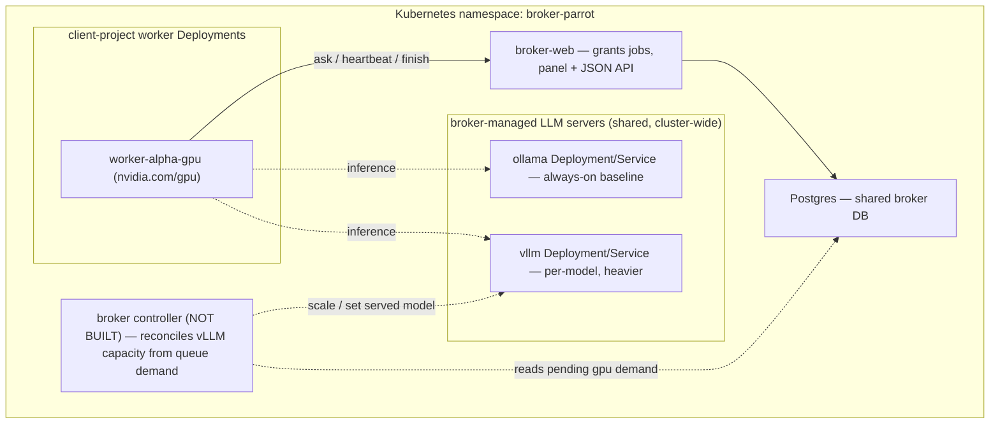

# 🎮 GPU model management & LLM backends

*How the GPU claim worker keeps one model warm, how a GPU fleet shares pooled work, how per-machine ollama/vLLM servers are wired, and the design for a broker-managed k8s LLM tier.*

This doc consolidates the former `gpu_pool.md`, `llm_backends.md`, and `broker_k8s_llm.md` into one place, since all three sit on the same physical resource — the GPU — and interact (a diffusion model, a pooled task, and a co-tenant LLM server all compete for the same VRAM on a box).

## Contents

1. [The GPU warm-model cache & routing](#1-the-gpu-warm-model-cache--routing)
2. [The shared GPU pool (pivot B)](#2-the-shared-gpu-pool-pivot-b)
3. [LLM backends: per-machine ollama / vLLM + idle supervisor](#3-llm-backends-per-machine-ollama--vllm--idle-supervisor)
4. [Broker-managed LLM on Kubernetes (design)](#4-broker-managed-llm-on-kubernetes-design)

---

## 1. The GPU warm-model cache & routing

### Why: reload cost dominates a short GPU job

A GPU node (diffusion, super-resolution, detection, …) declares `gpu: true` + `model: "<id>"` in its workflow JSON. Loading weights onto the GPU can take longer than running the job itself, so the whole point of a **long-lived GPU claim worker** (one process, concurrency-1) is to keep a model resident across consecutive same-model jobs and pay the load cost only on an actual swap.

### The two modules

- **`queue_workflows/model_cache.py`** — the cache *logic*, deliberately DB-decoupled. `ModelCache` never imports psycopg; every side effect is an injected callback:
  - `publish_current_model(model_id | None)` — advertise the loaded model (see below).
  - `register_builtins()` — the empty-registry re-registration fallback (below).
- **`queue_workflows/gpu_model_cache.py`** — wires the **one process-wide instance**. `gpu_model_cache()` lazily constructs a single `ModelCache` per process and injects `_publish_current_model`, which upserts `worker_heartbeats.current_model` (queue `'gpu'`) via `node_queue.upsert_worker_heartbeat`. This is late-bound (the shim re-reads the module-level function on every call) so a test that monkeypatches `_publish_current_model` is still observed.

A GPU worker is one process holding one model by contract, so one cache per process is correct — there is no cross-process sharing to reconcile.

### `require_model(model_id)` — the swap decision

```python
handle = gpu_model_cache().require_model("sdxl-base")
```

- Same model already loaded → return the cached handle immediately (no I/O).
- Different model (or none) loaded → `drop_cache()` (drop the ref, `gc.collect()`, `torch.cuda.empty_cache()`, `malloc_trim(0)`), publish `current_model = NULL` **mid-swap** (so the claim's affinity tiebreak doesn't try to pin a same-model job here while a load is in flight), resolve the id via `model_registry.get()`, call the spec's `loader()`, then publish the new `current_model`.
- If the registry is empty when resolved (a prefork `worker_process_init` race with the first task on a freshly-forked child), it re-runs the injected/configured builtin registrar and retries once.

`mark_busy()` / `mark_idle()` bracket each job (mirrors the watchdog bracket elsewhere in the engine) — `active` stays >0 while a job runs so the idle reaper never unloads mid-inference, and `mark_idle()` restarts the idle clock from the *end* of the job.

### `model_registry.py` + `ModelSpec`

```python
@dataclass
class ModelSpec:
    id: str
    loader: ModelLoader            # zero-arg factory -> handle
    unloader: ModelUnloader | None = None
    est_vram_gb: float = 0.0       # scheduler hint; see capacity-aware assignment below
```

`MODELS: dict[str, ModelSpec]` is populated by the **host**, never by the engine — the engine only owns the registry as a *target*. The host registers its specs via the `builtin_model_registrar` hook:

```python
queue_workflows.set_builtin_model_registrar(register_builtin_models)
```

This is called once at GPU-worker startup and again by `ModelCache`'s empty-registry fallback. `model_registry.py` stays cheap to import — no torch/diffusers at module load; loaders defer heavy imports until called. See [configuration](configuration.md) for the full hook-setter list.

### Warm-model affinity routing (the claim `ORDER BY`)

The GPU claim SQL (`node_queue._CLAIM_SQL`, see [architecture § the queue mechanism](architecture.md#3-the-queue-mechanism)) adds two tiebreaks after the capability gate:

1. **Affinity** — `required_model IS NOT DISTINCT FROM current_model` sorts first, so a worker with a model already warm preferentially claims a job needing that same model instead of forcing a cold worker to reload.
2. **`host_priority`** direction term — flips the creation-order walk (oldest-first for `host_priority >= 0`, newest-first for `< 0`) so a fleet can bias which host drains a queue first; set per-host via the `QUEUE_WORKFLOWS_GPU_CONSUMER_PRIORITY` env knob (`config.host_priority_env`).

Both tiebreaks are built only from validated ints/fixed SQL fragments — never caller strings — matching the engine-wide claim-SQL safety rule.

### Capacity-aware GPU model assignment (migration 0015)

Before 0015, *any* GPU worker could claim *any* GPU job as long as the model id was known — a model whose weights don't fit a given machine's VRAM was claimed anyway and OOM'd (or failed) at load, and if **no** machine in the fleet was big enough the node just sat `queued` forever with no visible reason. 0015 fixes both:

- **`worker_heartbeats.vram_total_mb`** — the machine's total GPU VRAM (MB), sampled by the worker each heartbeat (`ClaimWorker._vram_total_mb`, probed once and cached — a stable hardware property).
- **`worker_heartbeats.fits_models`** — `text[]` of registered model ids whose `est_vram_gb` fits this machine, computed **worker-side** via `model_registry.fits_within(vram_total_mb)` (the orchestrator holds no model registry, so the fit decision is pushed to the worker and advertised as plain data). A model with `est_vram_gb <= 0` (unset/informational) is treated as fitting everywhere; `vram_total_mb is None` (unknown capacity) advertises *all* known ids so a cold worker never wedges the queue.
- **`workflow_node_jobs.unassignable_at` / `unassignable_reason`** — the **red flag**. The node stays `queued` (not failed — the condition is transient: a bigger machine can come online and clear it). `node_queue.flag_unassignable_gpu_jobs()`, driven by `NodePool._sweep_unassignable_jobs` on an interval (default 15 s, `_unassignable_interval_s`), flags a queued `gpu` job with a `required_model` iff **no fresh GPU heartbeat** (within the stale-worker window, default 30 s) advertises that model in `fits_models`. It clears the flag once a live worker fits it, or once the job leaves `queued`.
  - **Liveness guard**: flagging requires at least one *fresh* GPU heartbeat to exist — if the whole GPU fleet is momentarily down (a deploy, all-workers bounce), that's a liveness gap, not a capacity verdict, so the sweep is a no-op rather than red-flagging every job.
  - Project-scoped (migration 0017): the sweep only judges a project's own jobs against that project's own fleet.
  - A newly-flagged row emits one `unassignable` `workflow_node_events` row (joins the event vocabulary added by 0011/0015 — see [architecture § durable node-event history](architecture.md)).

The claim capability gate (`node_queue._capability_clause`) itself still gates only on `known_models`/`required_model IS NULL`; `fits_models` is advertised data the fleet sweep reads, not (today) a second claim-time filter — a worker whose `fits_models` excludes a model simply never advertises it as "known" for the affinity sort in the first place when the caller passes `fits_models` as `known_models`.

### The idle-unload decision

```python
def gpu_should_unload(handle_present: bool, active: int, idle_s: float, ttl_s: float) -> bool:
    if ttl_s <= 0:
        return False
    return handle_present and active <= 0 and idle_s >= ttl_s
```

Pure function, unit-testable with no real waiting. `ModelCache.ensure_idle_reaper()` arms a daemon thread the first time `require_model` is called (idempotent; no-op if `QUEUE_WORKFLOWS_DISABLE_GPU_IDLE_REAPER` is set or `idle_ttl_s <= 0`), polling on `clamp(idle_ttl_s / 5, 5s, 60s)`. Default TTL is 60 s (`QUEUE_WORKFLOWS_GPU_MODEL_IDLE_TTL_S`) — short, so a shared GPU frees VRAM quickly for a co-tenant vLLM/ollama server between diffusion bursts (see [§3](#3-llm-backends-per-machine-ollama--vllm--idle-supervisor)). Each tick calls `reap_idle_once()`, which re-checks the same predicate under the lock and, if true, drops the cache and republishes `current_model = NULL`.

This is the same shape (`now_fn`/injectable clock, pure decision function, daemon-thread reaper) as the LLM idle supervisor in §3 and the watchdogs — a deliberate house style so the three GPU-idle mechanisms in this codebase read alike.

### GPU health sampling

Per-container GPU%/RAM sampling that backs the `GpuHealthWatchdog`'s wedge detection (health-driven, not wall-clock) is covered in **[watchdogs.md](watchdogs.md)** — not duplicated here. That watchdog is a *liveness* guard (is the job making progress); this section is a *capacity/residency* concern (which model is warm, does it fit).

---

## 2. The shared GPU pool (pivot B)

### Why a separate primitive from the DAG node-job

A DAG node-job (`workflow_node_jobs`) is bound to its app's own Postgres — its run row, dispatch outbox, leases, `workflow_node_events` — and to a local filesystem `out_dir`. A worker on a *different box* (let alone a different app) can't reach any of that. The shared GPU pool trades the DB-bound node-job for a **self-contained `PoolTask`**:

```
PoolTask = { model, handler, inputs, output_dir, params }
```

where `inputs` / `output_dir` are references into **shared NFS**, not local paths — a pooled worker reads/writes only the shared filesystem and the shared queue store, and **never opens an app's database**. The op *code* lives on each GPU box (a registered handler); the *data* lives on NFS.

### Addressed independently of `db_backend`

The pool is a `StorageBackend` (the same SPI backing the pluggable relational/redis/mongo `db_backend` seam — see [storage_backends.md](storage_backends.md)), but it is configured **separately** from an app's own `db_backend`:

```python
queue_workflows.configure(
    gpu_pool_backend="redis",                          # default; config.gpu_pool_backend
    gpu_pool_url_env="QUEUE_WORKFLOWS_GPU_POOL_URL",    # default; env var name holding the pool DSN
    gpu_pool_namespace="gpu_pool",                      # default; every app + box sharing a fleet uses the SAME value
)
```

An app keeps `db_backend="pg"` (or `"sqlite"`) for its own DAG/run state while pooled GPU workers **across apps** claim self-contained tasks from one shared redis store. The pool backend + connection are built lazily and cached by `(backend, url, namespace)` in `gpu_pool.py`'s module-level `_pool_backend()` — a namespace change (e.g. a test) rebuilds it; `close_pool_backend()` tears it down.

### Capability routing — by queue name, not a scheduler

A `PoolTask` is enqueued onto a **capability queue**: a model id, or a box-class name like `gpu:box-a` / `gpu:box-b`. A pooled worker serves an **ordered** set of queues via `claim_pool_task(queues=[...])`, which claims from the first non-empty queue in order — so the order itself *is* the routing policy (warm-model queue first for affinity, then box-class queues). This is coarser than the DAG GPU claim on purpose: no within-queue warm-model sort, no VRAM capacity-fit gate — the operator hand-partitions by choosing queue names.

### API

**Submitter (any app — needs no handlers registered locally):**

```python
from queue_workflows import gpu_pool

task_id = gpu_pool.submit_pool_task(
    queue="gpu:box-a", handler="upscale", model="sr",
    inputs={"src": "/nfs/in/img.png"}, output_dir="/nfs/out/job123",
    params={"scale": 4}, priority=0,
)
result = gpu_pool.await_pool_result(task_id, timeout_s=600)  # raises PoolTaskFailed / TimeoutError
```

**Worker (on each GPU box — registers the op code):**

```python
def upscale(*, inputs, output_dir, params):
    ...                       # read inputs from NFS, write to output_dir
    return {"out": f"{output_dir}/result.png"}

queue_workflows.register_pool_handler("upscale", upscale)

# claim -> resolve handler -> run -> atomic-outbox terminal
gpu_pool.run_pool_worker_once(queues=["sr", "gpu:box-a"], worker="box-a-1")
```

`execute_pool_task` resolves `payload["handler"]` against `config.gpu_pool_handlers` (populated by `register_pool_handler`); an unregistered handler name, or a raising handler, is written back through the backend's atomic `fail_with_event` — never a silent vanish. `renew_pool_lease` extends a lease while a handler runs (a renewer heartbeat, same shape as the DAG `LeaseRenewer`); `reclaim_expired_pool_leases()` re-queues tasks whose worker died mid-run.

**Not currently wired into any process.** Unlike the DAG lease-reclaim sweep (which `NodePool._tick` drives automatically), nothing in this repo calls `run_pool_worker_once` in a loop or `reclaim_expired_pool_leases` on a timer — a host stands up its own pooled-worker loop and its own sweep cron/thread. `gpu_pool.py` is the primitive; the worker process and orchestration around it are the consuming host's responsibility. Cross-link [configuration](configuration.md) (the `gpu_pool_*` knobs + `register_pool_handler`), [storage_backends.md](storage_backends.md) (the underlying SPI + its anti-leakage rule).

### Guarantees

- **Exactly-once terminal via an atomic outbox** — the worker writes the terminal status + result together (`complete_with_event`/`fail_with_event`), so a crash after the work is done never drops the result.
- **Lease + reclaim** — a dead worker's task is re-queued, not lost.
- **Namespace isolation** — two fleets on one shared redis server can't see each other's tasks.
- **No app-DB coupling** — pooled workers touch only the shared pool store + NFS, never an app's database.

---

## 3. LLM backends: per-machine ollama / vLLM + idle supervisor

### Why: a co-tenant VLM server shares the GPU with the DAG worker

A workflow node often needs a language/vision-language model (e.g. captioning or reasoning over an image) rather than an in-process diffusion model. Which *kind* of server a machine runs for that — **ollama** (an externally-managed long-lived daemon) or **vLLM** (an OpenAI-compatible server the engine can start/stop to reclaim VRAM) — is per-machine, operator-set state. `queue_workflows/llm_backends/` is the polymorphic seam: a factory reads that config, builds the matching backend, and every node drives it through one surface — never branching on server type itself.

The package is deliberately **OpenAI-chat-shape biased and vendor-coupled to exactly ollama + vLLM** (not a general LLM abstraction) — both speak the same `POST /…/chat` shape, so the host node is written once. It owns **request accounting** and the **lifecycle decision**; it does **not** make the HTTP call (the host node POSTs to `backend.chat_url` itself, bracketed by `mark_request_start`/`mark_request_end`) and it does **not** know about your container runtime. It imports nothing but stdlib + `queue_workflows.*`.

### The pieces (`queue_workflows/llm_backends/`)

| File | Role |
|---|---|
| `base.py` | `LLMBackend` (ABC) — concrete, shared request accounting; abstract identity (`server_type`, `chat_url`, `health_url`) + lifecycle (`ensure_ready`, `is_running`, `stop_server`). |
| `ollama.py` | `OllamaBackend` — every lifecycle method is a truthful no-op; the daemon self-manages idle via `OLLAMA_KEEP_ALIVE`. |
| `vllm.py` | `VLLMBackend` (+ `VLLMState`) — a real lifecycle state machine over fully-injected I/O (kill/ensure-up/health/served-model probes; httpx lazy-imported). |
| `supervisor.py` | `LLMSupervisor` (+ pure `vllm_should_stop`) — the idle-VRAM daemon for vLLM. |
| `factory.py` | `BackendFactory` / `get_backend(host_label, queue)` — the per-`(host, queue)` owner of the live backend + its supervisor, synced to the DB config. |

`LLMBackend`'s concrete half (`mark_request_start`/`mark_request_end`/`inflight`/`idle_seconds`) is the direct analog of `ModelCache`'s `active`/`last_used` busy-counter — RLock-guarded because the supervisor reads it off-thread, `now_fn`-injectable for deterministic tests.

- **`OllamaBackend`** — `chat_url` → `{base}/api/chat`, `health_url` → `{base}/api/tags`. `ensure_ready` is a no-op (the daemon cold-loads/hot-swaps on the first request itself), `is_running()` always `True` (no I/O — that's the host node's call to make), `stop_server()` always `False` (the engine never manages the daemon, so the idle supervisor's stop attempt is a truthful no-op).
- **`VLLMBackend`** — `chat_url` → `{base}/v1/chat/completions`, `health_url` → `{base}/health`. State machine `DEAD → LOADING → SERVING`, plus `RELOADING`/`SLEEPING_L2`/`UNSUPPORTED_SLEEP` for a model switch. vLLM pins one model in VRAM for its whole process lifetime with **no built-in idle unload** and **no hot model swap** — the intended fast path is vLLM **Sleep-Mode L2** (offload weights to host RAM, reload the new model into the same process), but `_sleep_l2_reload` is a deliberate stub (`raise NotImplementedError`); `ensure_ready` catches that once, sets a **sticky** `_sleep_unsupported` flag, and falls back permanently to the slow path (stop → cold-start the new model). After bring-up, the served model id is reconciled against a `/v1/models` probe and a **mismatch raises `RuntimeError`** (fail loud) — because the default `ensure_up_fn` is a no-op that relies on docker `restart: unless-stopped` bringing the sidecar back up on its **baked** `--model` flag, which may not be the newly-requested one; a consumer should soft-degrade (e.g. fall back to ollama) rather than silently POST to the wrong model.
- **`LLMSupervisor`** — mirrors `ModelCache`'s idle reaper exactly: pure decision `vllm_should_stop(running, inflight, idle_s, ttl_s)`, poll cadence `clamp(idle_ttl_s/5, 5s, 60s)`, gated by `QUEUE_WORKFLOWS_DISABLE_LLM_SUPERVISOR`. **Inert** for any non-`"vllm"` `server_type` and for `idle_ttl_s <= 0` — ollama is never touched. It only decides *when*; the actual kill is `backend.stop_server()`.

### `BackendFactory` — identity preservation + freshness

`get_backend(host_label, queue)` must hand back the **same instance** across calls as long as the config snapshot is unchanged — the backend's request counters and the vLLM state machine live *on* that instance, so a spurious rebuild would silently reset the idle clock and the served-model belief. The snapshot is `(server_type, parallelism, vllm_idle_ttl_s)`; on a genuine change, the old entry is torn down (`supervisor.stop()` then `backend.shutdown()`) and a new one built.

Two ways a re-read is triggered:

- a **TTL** throttle (default 10 s, `DEFAULT_CONFIG_TTL_S`) — the dropped-NOTIFY fallback;
- a **LISTEN** invalidator thread (`start()`/`stop()`, gated by `QUEUE_WORKFLOWS_DISABLE_LLM_CONFIG_LISTENER`) on the `worker_llm_config_changed` channel — instant refresh the moment an operator edits the config.

Server-root URLs are **not** part of the snapshot — they're deployment topology, resolved once from env at build time (`config.ollama_url_env` = `QUEUE_WORKFLOWS_OLLAMA_URL`, `config.vllm_url_env` = `QUEUE_WORKFLOWS_VLLM_URL`; a redeploy, not a runtime reconfig, is how a URL changes). vLLM's stop/start seams (`cfg.vllm_stop_fn` / `cfg.vllm_start_fn`, wired via `set_vllm_lifecycle(stop_fn, start_fn)`) let a host that runs vLLM as a **separate container** (e.g. via the docker Engine API over a unix socket) have the in-worker supervisor control the sibling sidecar without relying on a docker restart policy; `None` (default) falls back to the backend's own `pkill`/no-op seams. See [configuration](configuration.md) for the hook-setter list.

### Per-machine server config: DB owns *which*, env owns *where* (migration 0013)

`worker_controls` (already the ON/OFF control-plane row, migration 0012 — see [worker_control.md](worker_control.md)) gains three operator-set columns:

| Column | Meaning | Default |
|---|---|---|
| `llm_server_type` | `'ollama'` \| `'vllm'` | `'ollama'` |
| `llm_parallelism` | the **sidecar's** concurrent-request capacity (ollama `OLLAMA_NUM_PARALLEL` / vLLM `--max-num-seqs`) — **not** the claim-worker concurrency, which stays 1 by contract | `1` |
| `vllm_idle_ttl_s` | seconds of zero requests before the supervisor SIGTERMs the vLLM sidecar; ignored for ollama | `60` |

A row trigger fires `pg_notify('worker_llm_config_changed', '<host>|<queue>')` — a **distinct** channel (`|` separator) from the 0012 `worker_control` channel (`:` separator), so an LLM-config edit is never mistaken for an ON/OFF change by the hard-stop `WorkerControlWatcher`; the trigger stays quiet on an UPDATE that touches none of the three LLM columns. Read via `worker_control.llm_config_for(host, queue)`, written via `worker_control.set_llm_config(...)` (a partial `COALESCE` upsert that never touches `desired_state`).

The **root URL** is deliberately *not* in this table — it's per-host deployment topology (env), while *which server type* + its tunables is centrally operator-visible/editable state (DB). This split is why the factory's identity snapshot excludes the URL.

### Observed capability (migration 0014)

`worker_heartbeats.llm_servers_available text[]` (default `{ollama}`) is the **observed** counterpart — which server types *this machine can actually run* — computed by the worker at startup and re-advertised every heartbeat, set via `queue_workflows.set_llm_servers_available([...])`. Distinct from 0013's *desired* config: vLLM (the CUDA `vllm/vllm-openai` sidecar) runs only on NVIDIA boxes, never on a ROCm control box, so a queue UI reads this list to **gate** its per-machine server-type control — disable the vLLM toggle on a host with no sidecar for it, so an operator can't route VLM calls at a non-existent endpoint.

Both 0013 and 0014 are default-safe: a DB predating them (or an accessor call before they're applied) returns the all-defaults config / the `{ollama}` baseline, so the engine and any other consumer runs unchanged.

### Per-dispatch server resolution

`set_llm_server_resolver(resolver)` lets a host resolve the exact server (type + address + port) **per node-job** at dispatch time; `node_executor` threads the result in as `run(llm_server=...)`, so a node body never hardcodes a URL — it always asks for the backend the resolver decided on for that job.

### Operational notes

- One machine runs **one** server type at a time — that is what the `llm_server_type` toggle means.
- vLLM cold start is real (roughly 1–4 min for a 7B AWQ on a modern GPU); the supervisor's idle-stop trades that cold start for reclaimed VRAM. ollama is always up but serializes by default (raise `OLLAMA_NUM_PARALLEL` for concurrency).
- vLLM has no hot model swap — a model switch is a server restart; ollama hot-loads a new tag on the running daemon.
- A vLLM server needs its model **fully present** in that host's own model cache before it can serve; an incomplete download makes the loader block (looks like a hang).

### Coexisting with the diffusion / model-cache lane (§1)

A diffusion (or SR/CV) model **never** goes through ollama or vLLM — those only serve language/vision-language models. A model-backed GPU node runs in-process in the claim worker's *inline* lane (concurrency-1, the warm `ModelCache` from §1); the LLM server, if any, runs *beside* it on the same physical GPU, fed only by a separate *pool* lane of VLM-only jobs (`require_model IS NULL`). The two lanes share one GPU, so a machine's total concurrent node-jobs is capped at `PAR` (the sidecar's `llm_parallelism`), and while an inline diffusion job runs it occupies one of those `PAR` slots (`PAR − 1` budgeted to the pool feeder). Running a resident LLM server *and* a diffusion model on one GPU competes for VRAM — this is precisely why the vLLM supervisor idle-stops the server (freeing VRAM for diffusion between VLM bursts) and why the diffusion side's own idle TTL (§1, default 60 s) is short.

---

## 4. Broker-managed LLM on Kubernetes (design)

> **Status: design + starting-point manifests only — NOT deployed.** Nothing described in this section runs today; it documents the v2 direction so future work builds toward it deliberately. See [`broker.md`](broker.md) for the shipped broker orchestration core this design extends, and `deploy/k8s/` for the (inert) manifests.

### The direction

Today (the per-host engine described in §1–§3) each machine runs its **own** ollama/vLLM and workers self-claim work from Postgres. The v2 direction the operator has set is to **centralize** both halves: one broker service owns the shared CPU/GPU queue and *grants* permission to worker Deployments (see [`broker.md`](broker.md) for the grant/heartbeat/finish protocol), and the LLM servers move from "one per host" to **one shared deployment per cluster** — ollama and vLLM each run once, behind a Kubernetes Service, used by every client project. Client projects stop running their own model servers and instead point `QUEUE_WORKFLOWS_OLLAMA_URL` / `QUEUE_WORKFLOWS_VLLM_URL` at the cluster Service.



### Why this is a natural extension, not a rewrite

The per-machine abstraction already built in §3 — `llm_backends/` (ollama/vLLM backends + the idle supervisor) and the desired/observed control columns (`worker_controls.llm_*` from 0013, `worker_heartbeats.llm_servers_available` from 0014) — is exactly the machinery a cluster-level controller needs, just **relocated**: ollama stays the always-on baseline (one Deployment); a **broker controller** (a small k8s controller, *to be built*) would read live GPU demand from the queue (which `model` the pending/granted `gpu` jobs need) and drive the `vllm` Deployment to serve it — set its `--model` arg / scale it, or run one Deployment per hot model behind per-model Services. Workers would never start/stop a sidecar themselves; they'd just call the Service URL, and the in-worker `LLMSupervisor` becomes unnecessary once the cluster owns the server's lifecycle.

### Migration path (per project, incremental)

1. Stand up `broker-web` + Postgres + the shared `ollama`/`vllm` Services.
2. Point a project's workers at the broker (deploy `queue-broker-worker` for its lanes, register its handlers in the worker image — see [`broker.md`](broker.md)).
3. Set the project's `QUEUE_WORKFLOWS_OLLAMA_URL` / `QUEUE_WORKFLOWS_VLLM_URL` to the cluster Services and retire its own per-host ollama/vLLM (done per project, in that project's own repo).
4. Once every project is on the broker, retire the legacy per-host autonomous-worker engine described in §1–§3 above.

### Gaps — not built yet

- **The broker controller** that reconciles vLLM capacity from queue demand — today's manifests, if applied, would run vLLM *statically*.
- **Concurrency-safe grant** — the broker's job-granting endpoint is check-then-act and runs a single replica; running more than one needs a serialized/locked grant first.
- **Auth beyond a shared token**, and real secrets/image builds.
- **Removing per-project ollama/vLLM** happens in each consumer's own repo, outside this one.

---

## See also

- [architecture.md](architecture.md) — the claim SQL, lease/reclaim, and the process roles the GPU worker plays.
- [watchdogs.md](watchdogs.md) — the wall-clock, stall, and GPU-health watchdogs that police a *running* GPU job (a liveness concern, distinct from this doc's residency/capacity concerns).
- [worker_control.md](worker_control.md) — the operator ON/OFF plane that `worker_controls` (this doc's migration 0013 columns live on the same table) also implements.
- [configuration.md](configuration.md) — every hook-setter (`set_builtin_model_registrar`, `set_llm_servers_available`, `set_vllm_lifecycle`, `set_llm_server_resolver`, `register_pool_handler`) and env knob named above.
- [storage_backends.md](storage_backends.md) — the `StorageBackend` SPI the shared GPU pool (§2) and `db_backend` both build on.
- [broker.md](broker.md) — the v2 broker orchestration core that §4's k8s design extends.
